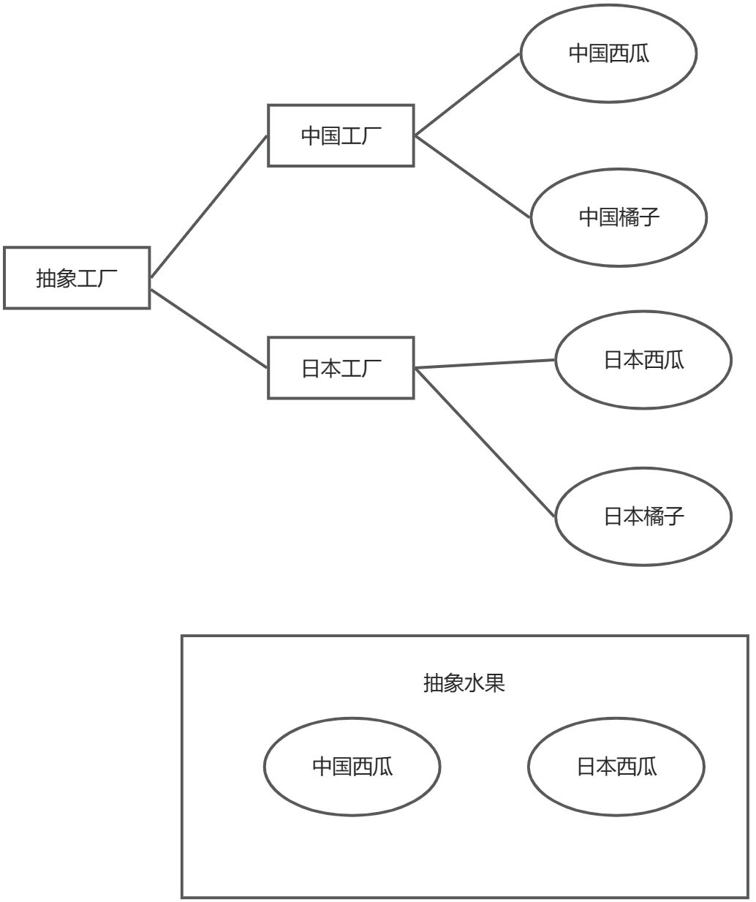

#  什么是设计模式

设计模式：用于解决在特定环境下、重复出现的，特定问题的解决方案，基于面向对象的设计原则：主要是对接口编程而不是对实现编程、优先使用对象组合而不是继承。

#  设计模式类型

**23种设计模式可分为三类：创建型模式、结构型模式、行为模式。**

- 简单工厂模式、单例模式、抽象工厂模式、原型模式、建造者模式（5种）。
-  代理模式、外观模式、享元模式、组合模式、装饰器模式、适配器模式、桥接模式（7种）
- 访问者模式、策略模式、模板模式、状态模式、备忘录模式、观察者模式、中介者模式、迭代器模式、解释器模式、责任链模式、命令模式（11 种）。

# 设计模式原则

**面向对象的设计原则**，如SOLID原则，包括：

- **单一职责原则（SRP）**：一个类应该只有一个引起它变化的原因。
- **开放封闭原则（OCP）**：软件实体应当对扩展开放，对修改封闭。
- **里氏替换原则（LSP）**：子类在不改变原有程序的情况下，可以替换其基类。
- **接口隔离原则（ISP）**：使用多个专门的接口比使用单一的总接口要好。
- **依赖倒置原则（DIP）**：高层模块不应依赖低层模块，二者都应依赖于抽象；抽象不应依赖于细节，细节应依赖于抽象。

# 创建型模式

## 简单工厂模式

**简单工厂模式主要解决接口选择问题。**

Factory(工厂)的核心部分，负责实现创建所有产品的内部逻辑，工厂类可以被外界直接调用，创建所需对象即可。应用场景：比如开发中设计一个连接 5种数据库的框架：SQL Server、MySQL、Oracle、SQLite、Redis，可以将5种作为产品类共同实现一个接口。


##  抽象工厂模式

抽象工厂模式（Abstract Factory Pattern）用于产品族的构建。**抽象工厂是所有形态的工厂模式中最为抽象和最具一般性的一种形态。**抽象工厂是指当有多个抽象角色时使用的一种工厂模式。**抽象工厂模式可以向客户端提供一个接口，使客户端在不必指定产品的具体情况下，创建多个产品族中的产品对象。**工厂模式中的每一个形态都是针对一定问题的解决方案，工厂方法针对的是多个产品系列结构；而抽象工厂模式针对的是多个产品族结构，一个产品族内有多个产品系列。提供一个创建一系列相互依赖对象的接口，而无需指定它们具体的类。**主要目的解决：主要解决接口问题的选择。**

在抽象工厂模式当中，客户端不再负责对象的创建，而是把这个责任丢给具体的工厂类，客户端只负责对对象的调用，从而明确各个类的职责。

抽象工厂模式当中存在四种角色：**抽象工厂角色**、**具体工厂角色**，**抽象产品角色，具体产品角色。**



##  单例模式

单例模式的定义：保证一个类仅有一个实例，并提供一个访问它的全局访问点。单例模式是一种常用的软件设计模式。 在它的核心结构中只包含一个被称为单例的特殊类。通过单例模式可以保证系统中一个类只有一个实例而且该实例易于外界访问，从而方便对实例个数的控制并节约系统资源。如果希望在系统中某个类的对象只能存在一个，单例模式是最好的解决方案。

单例模式有 3 个特点：

-  单例类只有一个实例对象；
- 单例类必须自己创建自己的唯一实例；
- 单例类对外提供一个访问该单例的全局访问点。

**主要解决：全局使用的类频繁地创建与销毁。**

**优点：避免对资源的多重占用。在内存里只有一个实例，减少内存的开销，尤其是频繁的创建和销毁实例**。

###  懒汉模式

```cpp
//只有被调用时才会创建对象
SingleTonlazy* SingleTonlazy::pSingletontest = NULL;
```

### 饿汉模式

```cpp
// Singletonhungry类外部初始化的时候直接创建对象，在main()之前执行
Singletonhungry* Singletonhungry::pSingletontest = new Singletonhungry;
```

## 原型模式

原型模式是一种创建型设计模式，其功能为复制一个运行时的对象，包括对象各个成员当前的值。而代码又能保持独立性。用原型实例指定创建对象的种类，并且通过拷贝这些原型创建新的对象

**主要解决：在运行期建立和删除原型**。
	**优点：性能提高、避免构造函数的约束**

纯虚函数（特殊的虚函数，又叫做抽象函数），在基类不能对虚函数给出有意义的实现，而把它声明为纯虚函数，它的实现留给基类
的派生类去完成。

C++语言支持两种多态性：编译时多态性（通过重载函数、去重符重载实现）和运行时多态性（通过虚函数和继承实现）

**拷贝构造函数被调用场景如下：**

1、用已知对象初始化一个正在被创建的对象，调用拷贝构造函数；

2、函数形式参数为对象的时候，实参对象向形参对象传递，调用拷贝构造函数。

3、函数的返回值为对象的时候，当需要获取返回值时，调用拷贝构造函数

```C++
#include <iostream>
#include"designmodel.h"
using namespace std;

class ProtoType {  // 凡是含有纯虚函数的类叫做抽象类
public:
	ProtoType(){
	}
	~ProtoType() {
	}

	virtual ProtoType* CloneFunc() = 0;  // 纯虚函数
};

class ConreteProtoType:public ProtoType
{
public:
	ConreteProtoType(int imember):_member(imember) {
		cout << "执行ConreteProtoType带参构造函数.\n" << endl;
	}
	~ConreteProtoType() {
		cout << "执行ConreteProtoType析构函数." << endl;
	}

	// 拷贝构造函数（若有指针成员变量，要进行实现深拷贝）
	ConreteProtoType(const ConreteProtoType& rhs) {
		_member = rhs._member;
		cout << "数据成员_member1：" << _member << endl;
	}

	ConreteProtoType* CloneFunc() { // 派生类实现
		cout << "正在处理克隆." << endl;
		cout << "数据成员_member2：" << _member << endl;
		return new ConreteProtoType(*this);
	}

private:
	int _member;

};

int testProtoTypeModel()
{
	cout << "main()函数-->原型模式开始.\n" << endl;

	ConreteProtoType* CloneObjA = new ConreteProtoType(88);
	ConreteProtoType* CloneObjB = CloneObjA->CloneFunc();

	cout << endl;

	delete CloneObjA;
	CloneObjA = nullptr;
	delete CloneObjB;
	CloneObjB = nullptr;
	return 0;
}
```


# 结构型模式

## 代理模式

代理模式定义：为其他对象提供一种代理以控制对这个对象的访问。一个类代表另一个类的功能（属于结构型模式）。代理模式的结构图如下：


-  Subject：目标接口，定义代理和具体目标对象的接口，这样就可
- 以在任何使用具体目标对象的地方使用代理对象。
-  RealSubject：具体的目标对象，真正实现目标接口要求的功能。
- Proxy：代理对象。

**应用场景：优化接口性能。**

优点和缺点：职责非常清晰；高扩展性；智能化。造成请求的处理速度慢；实现非常复杂。

## 外观模式

外观模式定义：为子系统的一组接口提供一个统一的接口，该模式定义了一个高层接口，这一个高层接口使的子系统更加容易使用。并且外观模式可以解决层结构分离、降低系统耦合度和为新旧系统交互提供接口功能。

外观模式的结构图如下：


- Facede：这个外观类为子系统提供一个共同的对外接口。
- Client：客户对象通过一个外观接口读写子系统中各接口的数据资料。

**外观模式适应场景：**设计初期阶段，应该有意识的将不同层分离，层与层之间建立外观模式；在开发阶段，子系统越来越复杂，增加外观械提供一个简单的调用接口。

**外观模式优点**：实现子系统与客户端之间松耦合关系；客户端屏蔽子系统组件，减少客户端所需处理的对象数目，并且使得子系统使用起来更加容易。

# 行为模式

##  访问者模式

访问者模式定义：表示一个作用于某对象结构中的各元素的操作。它使你可以在不改变各元素的类的前提下定义作用于这些元素的新操作。访问者模式的结构图如下：


-  Visitor：访问者接口。
- ConcreteVisitor：具体的访问者实现对象。
- Element：被访问元素接口。
- ConcreteElement：具体元素实现对象
- ObjectStructure：对象结构。

**访问者模式的本质：** 预留通路，回调实现。

**访问者模式的优点与缺点**：扩展性好；复用性好；分离无关行为。对访问者模式的优点与缺点：扩展性好；复用性好；分离无关行为。对象结构变化困难；破坏封装。

## 备忘录模式

备忘录模式定义：在不破坏封装性的前提下，捕获一个对象的内部状态，并在该对象之外保存这个状态。这样以后就可将对象恢复到原先保存的状态。备忘录模式的结构图如下：


- Memento：备忘录。
- Originator：原发器。
- Caretaker：备忘录管理者。

**备忘录模式优点和缺点：**更好的封装性；简化原发器；窄接口和宽接口。可能导致高开销。

**备忘录模式的本质：保存和恢复内部状态。**

## 观察者模式

观察者模式定义：定义对象的一种一对多的依赖关系。**当一个对象的状态发生改变时，所有依赖于它的对象都得到通知被自动更新**。观察者模式的结构图如下：


- Subject：目标对象。
- Observer：定义观察者的接口。
- ConcreteSubject：具体的目标实现对象。
- ConcreteObserver：具体的观察者实现对象。

**观察者模式优点和缺点**：实现观察者和目标之间的抽象耦合；动态联动；支持广播通信。可能会引起无谓的操作。

**观察者模式的本质：触发联动。**