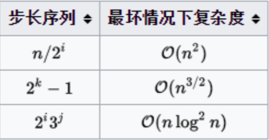

# 排序算法性能对比

常见的排序算法及其平均时间复杂度和空间复杂度如下表所示：

| 排序算法 | 平均时间复杂度 | 最坏时间复杂度 | 空间复杂度 | 稳定性 |
| -------- | -------------- | -------------- | ---------- | ------ |
| 冒泡排序 | O(n^2)         | O(n^2)         | O(1)       | 稳定   |
| 选择排序 | O(n^2)         | O(n^2)         | O(1)       | 不稳定 |
| 插入排序 | O(n^2)         | O(n^2)         | O(1)       | 稳定   |
| 希尔排序 | O(n^(1.3~2))   | O(n^2)         | O(1)       | 不稳定 |
| 归并排序 | O(n log n)     | O(n log n)     | O(n)       | 稳定   |
| 快速排序 | O(n log n)     | O(n^2)         | O(log n)   | 不稳定 |
| 堆排序   | O(n log n)     | O(n log n)     | O(1)       | 不稳定 |
| 基数排序 | O(d * (n + b)) | O(d * (n + b)) | O(n + b)   | 稳定   |
| 桶排序   | O(n + k)       | O(n^2)         | O(n)       | 稳定   |

**说明：**

- n：待排序元素数量
- d：数据的位数
- b：基数
- k：桶的数量

#  排序算法适用场景

选择合适的排序算法需要考虑以下因素：

- **数据规模：** 数据量较小时，简单的排序算法如冒泡排序、选择排序、插入排序即可满足需求。数据量较大时，需要使用更高效的排序算法如归并排序、快速排序、堆排序等。
- **时间复杂度：** 当对排序速度要求较高时，应选择时间复杂度较低的排序算法。
- **空间复杂度：** 当内存空间有限时，应选择空间复杂度较低的排序算法。
- **稳定性：** 当需要保持相同元素的相对顺序时，应选择稳定的排序算法。

以下是几种常见排序算法的适用场景：

- **冒泡排序、选择排序、插入排序：** 适用于数据量较小且对性能要求不高的场景。
- **归并排序：** 适用于需要稳定排序且对空间复杂度要求不高的场景。
- **快速排序：** 适用于对排序速度要求较高且数据量较大的场景。
- **堆排序：** 适用于需要快速找到最大值或最小值的场景。
- **基数排序、桶排序：** 适用于数据分布比较均匀的场景。

# 冒泡排序

```C++
void bubbleSort(int arr[], int n) {
    for (int i = 0; i < n - 1; i++) {
        for (int j = 0; j < n - i - 1; j++) {
            if (arr[j] > arr[j + 1]) {
                std::swap(arr[j], arr[j + 1]);
            }
        }
    }
}

int main() {
    int n = 5;
    int* arr = new int[n];
    for (int i = 0; i < n; i++) {
        std::cin >> arr[i];
    }
    bubbleSort(arr, n);
    for (int i = 0; i < n; i++) {
        std::cout << arr[i]<<"   ";
    }
    delete[]arr;
}
```

# 选择排序

```C++
#include<iostream>
#include<vector>
using namespace std;
void selectSort(int *arr,int len) {
    for (int i = 0; i < len; i++) {
        int min = i;
        for (int j = i+1; j < len; j++) {
            if (arr[min] > arr[j])min = j;
        }
        int tem = arr[min];
        arr[min] = arr[i];
        arr[i] = tem;
    }
}

int main() {
    int n = 5;
    int* arr = new int[n];
  
   
    for (int i = 0; i < n; i++)
        cin >> arr[i];
    selectSort(arr, n);
    for(int i=0;i<n;i++)
        cout << arr[i]<<"  ";
    delete[]arr;
}
```

# 插入排序

将一个未排序的元素插入到已排序的子数组中的正确位置

```C++
#include<iostream>
#include<vector>
using namespace std;

void insertSort(int *arr,int len) {
    for (int i = 1; i < len; i++) {
        int key = arr[i];
        int j = i - 1;
        while (j >= 0 && arr[j] > key) {
            arr[j + 1] = arr[j];
            j--;
        }
        arr[j + 1] = key;
    }
}

int main() {
    int n = 5;
    int* arr = new int[n];
  
   
    for (int i = 0; i < n; i++)
        cin >> arr[i];
    insertSort(arr, n);
    for(int i=0;i<n;i++)
        cout << arr[i]<<"  ";
    delete[]arr;
}
```

# 希尔排序

实质就是分组插入排序，该方法又称递减增量排序算法，因DL．Shell于1959年提出而得名。希尔排序是非稳定的排序算法。步长的选择是希尔排序的重要部分。**只要最终步长为1任何步长序列都可以工作**。算法最开始以一定的步长进行排序。然后会继续以一定步长进行排序，最终算法以步长为1进行排序。当步长为1时，算法变为插入排序，这就保证了数据一定会被排序。



```C++
#include<iostream>
#include<vector>
using namespace std;

void shellSort(int arr[], int len) {
    int gap, i, j;
    int temp;
    for (gap = len >> 1; gap > 0; gap >>= 1)//右移除以二
        for (i = gap; i < len; i++) {
            temp = arr[i];
            for (j = i - gap; j >= 0 && arr[j] > temp; j -= gap)
                arr[j + gap] = arr[j];
            arr[j + gap] = temp;
        }
}

int main() {
    int n = 5;
    int* arr = new int[n];
  
   
    for (int i = 0; i < n; i++)
        cin >> arr[i];
    shellSort(arr, n);
    for(int i=0;i<n;i++)
        cout << arr[i]<<"  ";
    delete[]arr;
}
```


# 归并排序

```C++
void merge(int arr[], int l, int m, int r) {
      int n1 = m - l + 1;
     int n2 = r - m;

    int* L = new int[n1];
    int* R = new int[n2];
    for (int i = 0; i < n1; i++) {
        L[i] = arr[l + i];
    }
    for (int j = 0; j < n2; j++) {
        R[j] = arr[m + 1 + j];
    }

    int i = 0, j = 0, k = l;

    while (i < n1 && j < n2) {
        if (L[i] <= R[j]) {
            arr[k] = L[i];
            i++;
        }
        else {
            arr[k] = R[j];
            j++;
        }
        k++;
    }

    while (i < n1) {
        arr[k] = L[i];
        i++;
        k++;
    }

    while (j < n2) {
        arr[k] = R[j];
        j++;
        k++;
    }

    delete[] L;
    delete[] R;
}

void mergeSort(int arr[], int l, int r) {
    //归并排序
    if (l < r) {
        int m = (l + r )/ 2;
        mergeSort(arr, l, m);
        mergeSort(arr, m + 1, r);
        merge(arr, l, m, r);
    }
}
int main() {
    int n = 5;
    int* arr = new int[n];
    for (int i = 0; i < n; i++) {
        std::cin >> arr[i];
    }
    mergeSort(arr, 0, n-1);
    for (int i = 0; i < n; i++) {
        std::cout << arr[i]<<"   ";
    }
    delete[]arr;
}
```

# 快速排序

该方法的基本思想是：

- 1．先从数列中取出一个数作为基准数。
- 2．分区过程，将比这个数大的数全放到它的右边，小于或等于它的数全放到它的左边。
- 3．再对左右区间重复第二步，直到各区间只有一个数。  

```C++

int partition(int arr[], int low, int high) {
    int pivot = arr[high];
    int i = low - 1;

    for (int j = low; j <= high - 1; j++) {
        if (arr[j] < pivot) {
            i++;
            std::swap(arr[i], arr[j]);
        }
    }
    std::swap(arr[i + 1], arr[high]);
    return (i + 1);
}

void quickSort(int arr[], int low, int high) {
    if (low < high) {
        int pi = partition(arr, low, high);
        quickSort(arr, low, pi - 1);
        quickSort(arr, pi + 1, high);
    }
}


int main() {
    int n = 5;
    int* arr = new int[n];
    for (int i = 0; i < n; i++) {
        std::cin >> arr[i];
    }
    quickSort(arr, 0, n-1);
    for (int i = 0; i < n; i++) {
        std::cout << arr[i]<<"   ";
    }
    delete[]arr;
}
```

```C++
#include<iostream>
#include<vector>
using namespace std;
//快速排序
void quickSort(int s[], int l, int r)
{
    if (l < r)
    {
        int i = l, j = r, x = s[l];
        while (i < j)
        {
            while (i < j && s[j] >= x) // 从右向左找第一个小于x的数
                j--;
            if (i < j)
                s[i++] = s[j];

            while (i < j && s[i] < x) // 从左向右找第一个大于等于x的数
                i++;
            if (i < j)
                s[j--] = s[i];
        }
        s[i] = x;
        quickSort(s, l, i - 1); // 递归调用 
        quickSort(s, i + 1, r);
    }
}

int main() {
    int n = 5;
    int* arr = new int[n];
    for (int i = 0; i < n; i++) {
        std::cin >> arr[i];
    }
    quickSort(arr, 0,n-1);
    for (int i = 0; i < n; i++) {
        std::cout << arr[i] << "   ";
    }
    delete[]arr;
}
```


# 堆排序

```C++
void heapify(int arr[], int n, int i) {
    int largest = i;
    int l = 2 * i + 1;
    int r = 2 * i + 2;

    if (l < n && arr[l] > arr[largest]) {
        largest = l;
    }

    if (r < n && arr[r] > arr[largest]) {
        largest = r;
    }

    if (largest != i) {
        std::swap(arr[i], arr[largest]);
        heapify(arr, n, largest);
    }
}

void heapSort(int arr[], int n) {
    for (int i = n / 2-1 ; i >= 0; i--) {
        heapify(arr, n, i);
    }

    for (int i = n-1 ; i >= 0; i--) {
        std::swap(arr[0], arr[i]);
        heapify(arr, i, 0);
    }
}


int main() {
    int n = 5;
    int* arr = new int[n];
    for (int i = 0; i < n; i++) {
        std::cin >> arr[i];
    }
    heapSort(arr, n);
    for (int i = 0; i < n; i++) {
        std::cout << arr[i]<<"   ";
    }
    delete[]arr;
}
```
